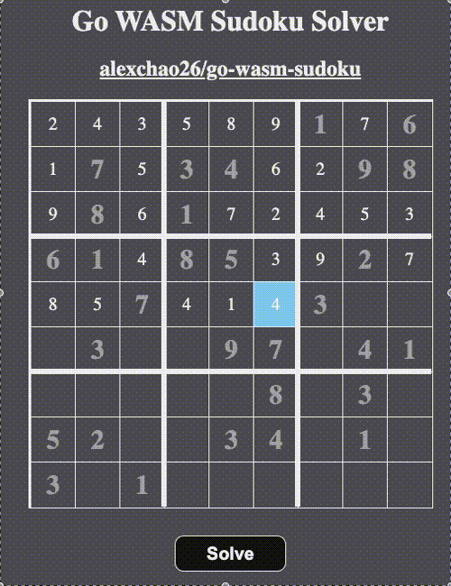

# Sudoku Solver in Go WASM

I chose a sudoku solver because it provides a good medium for visualizing a brute force, backtracking solution.

---
### Goals/Learnings
- See how painful it is to write WASM compiled Go code.
- See the state of WASM in Go
    - The standard library `syscall/js` package is experimental and outside of the Go backwards compatibility promise. This also leads to some outdated resources online because of API changes.
    - It's serviceable for small visualizations as it is essentially vanilla JS DOM manipulation. In fact I might make a small wrapper package for visualizing advent of code solutions as they tend to look pretty.

### Running
`make build`: to build the wasm binary `main.wasm`
`make run`: runs a local file server that can be visited at localhost:8080

